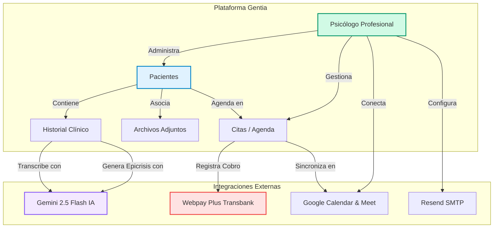
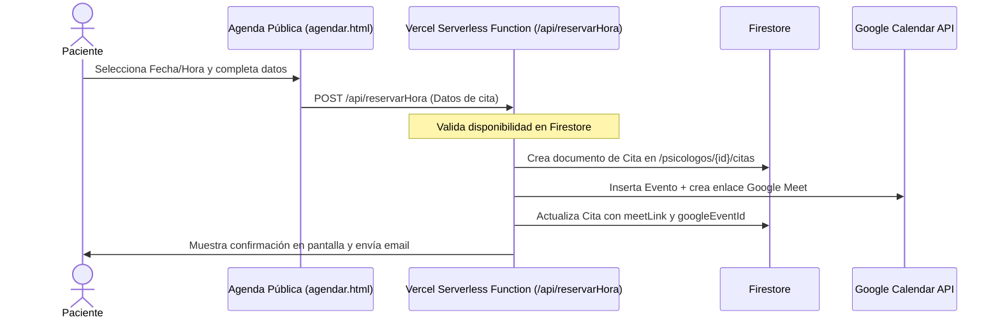
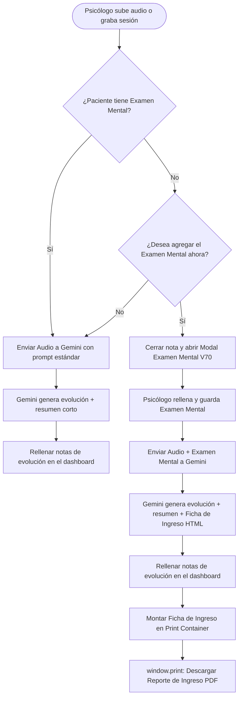

# Documentación Oficial de Ingeniería y Negocio: gentia.cl 🧠

Este documento detalla la visión comercial, arquitectura técnica, modelo de datos e ingeniería de privacidad de **Gentia.cl**, un software de gestión clínica y agendamiento serverless diseñado específicamente para psicólogos y profesionales de la salud mental en Chile.

---

## 1. Visión Estratégica y Comercial

### Misión
Democratizar el acceso a herramientas de gestión clínica y automatización digital de alta gama para profesionales de la salud mental en Chile, ofreciendo una plataforma robusta, segura y con una estructura de precios altamente competitiva que elimine las barreras de entrada tecnológica.

### Visión
Convertirse en el software de registro clínico EMR (Electronic Medical Record) y agendamiento de referencia en el mercado chileno, liderando la integración práctica de Inteligencia Artificial (transcripciones clínicas, resúmenes automáticos y epicrisis) en la terapia diaria, garantizando el cumplimiento normativo más estricto del sector.

---

## 2. Mapa Conceptual del Sistema (Concept Map)

El siguiente diagrama Mermaid esquematiza las entidades de la plataforma y su interacción en el flujo clínico y financiero:



---

## 3. Arquitectura de Aislamiento y Privacidad (Base de Datos)

De acuerdo con la **Ley N° 20.584** (Regula los derechos y deberes que tienen las personas en relación con acciones vinculadas a su atención en salud en Chile), la ficha clínica es un documento altamente sensible y confidencial. 

Para asegurar un aislamiento absoluto entre distintos psicólogos que utilicen la plataforma (multi-tenancy), Gentia utiliza una **arquitectura de aislamiento por ruta de subcolección** en Google Cloud Firestore:

### Estructura Jerárquica NoSQL:

```
/psicologos/{psicologoId} [Documento raíz del profesional]
  ├── nombre: "Ps. Valentina Castro"
  ├── email: "valentina@correo.com"
  ├── precioOnline: 25000
  ├── precioPresencial: 35000
  ├── suscripcion: { plan: "pro", estado: "activo" }
  ├── googleTokens: { access_token: "...", refresh_token: "..." }
  │
  ├── citas/{citaId} [Subcolección de Citas]
  │     ├── pacienteId: "66666666"
  │     ├── fecha: "2026-07-15"
  │     ├── hora: "16:00"
  │     ├── precio: 25000
  │     └── estado: "confirmado"
  │
  └── pacientes/{pacienteId} [Subcolección de Pacientes]
        ├── nombre: "Tomás Valenzuela"
        ├── rut: "14.789.012-4"
        ├── telefono: "96666666"
        ├── antecedenteMed: "Diabetes"
        ├── motivoConsulta: { origen: "Derivado", manifiesto: "...", latente: "..." }
        ├── examenMental: { apariencia: "Aseado", juicio: "Conservado", insight: "Adecuado" }
        │
        ├── archivos/{archivoId} [Metadatos de documentos asociados]
        │     ├── nombre: "Consentimiento_Informado.pdf"
        │     ├── url: "https://storage.googleapis.com/..."
        │     └── tipo: "Consentimiento"
        │
        └── historial/{notaId} [Timeline de evoluciones clínicas]
              ├── contenido: "Paciente muestra avances en control de impulsos..."
              ├── tipo: "Evolución"
              ├── ansiedad: 3
              ├── depresion: 2
              ├── estres: 4
              └── createdAt: ServerTimestamp()
```

### Reglas de Seguridad Criptográficas (Firestore Rules)
El acceso directo desde el navegador del psicólogo a la base de datos está blindado por la siguiente regla en `firestore.rules`. El backend de Firebase valida que el UID de la sesión autenticada coincida exactamente con la ID del psicólogo dueño de la rama de datos:

```javascript
rules_version = '2';
service cloud.firestore {
  match /databases/{database}/documents {
    // Aislamiento completo: Solo el psicólogo dueño de la colección {psicologoId}
    // puede leer o escribir en cualquiera de sus subcolecciones secundarias.
    match /psicologos/{psicologoId}/{document=**} {
      allow read, write: if request.auth != null && request.auth.uid == psicologoId;
    }
  }
}
```
*Ningún psicólogo o tercero puede realizar consultas transversales (cross-tenant) a los pacientes de otro profesional.*

---

## 4. Casos de Uso y Flujos de Proceso

### Caso de Uso 1: Reserva de Cita Pública por el Paciente
Explica el flujo cuando un paciente accede a la agenda pública de un psicólogo para reservar una sesión.



---

### Caso de Uso 2: Transcripción de Audio y Ficha de Ingreso Completa
Este flujo describe el procesamiento condicional del audio de la primera sesión combinado con el Examen Mental (V70) para generar y exportar la Ficha de Ingreso Completa en PDF.



---

## 5. Esquema de Licenciamiento y Restricciones (Business Logic)

Para maximizar la conversión en Chile con precios competitivos, la aplicación delimita sus funciones en 3 niveles (Free, Lite, Pro):

### 1. Plan de Prueba Gratuito (Free Trial - 30 días)
*   **Límite de Pacientes**: Máximo 3 pacientes registrados en Firestore. El botón "Nuevo Paciente" se bloquea automáticamente en la interfaz.
*   **Agendamiento y Agenda**: Sí, acceso completo.
*   **Google Calendar Sync**: Sí, habilitado para probar.
*   **Funciones IA (Gemini)**: Deshabilitadas (el micrófono de transcripción y el botón de Epicrisis se ocultan de la interfaz).

### 2. Gentia Lite ($9.990 CLP/mes)
*   **Límite de Pacientes**: Sin límites.
*   **Fichas Clínicas, Examen Mental e Historial**: Sí, acceso completo.
*   **Google Calendar Sync**: Habilitado.
*   **Funciones IA (Gemini)**: Deshabilitadas.

### 3. Gentia Pro ($14.990 CLP/mes)
*   **Límite de Pacientes**: Sin límites.
*   **Google Calendar Sync**: Habilitado.
*   **Funciones IA (Gemini)**: Habilitado (Epicrisis IA, Transcripción por voz/archivo de audio, resúmenes automáticos y generación de Ficha de Ingreso).

---

## 6. Configuración de API Key de Gemini: Paso a Paso
Para usar las funciones del plan Pro, el psicólogo debe ingresar su clave API de Google Gemini en **Ajustes** -> **Preferencias y Precios**:

1.  Ingresa a la consola de **[Google AI Studio](https://aistudio.google.com/)** con tu cuenta de Google.
2.  Haz clic en el botón azul en la esquina superior izquierda: **"Get API key"** (Obtener clave de API).
3.  Haz clic en **"Create API key"** (Crear clave de API).
4.  Selecciona o crea un proyecto de Google Cloud gratuito y haz clic en **"Create API key in existing project"**.
5.  Copia la clave generada (comienza con `AIzaSy...`).
6.  Pégala en el panel de Gentia en el campo **API Key de Gemini** y presiona **Guardar Ajustes**.
